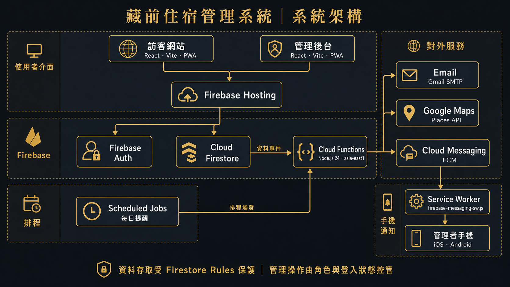
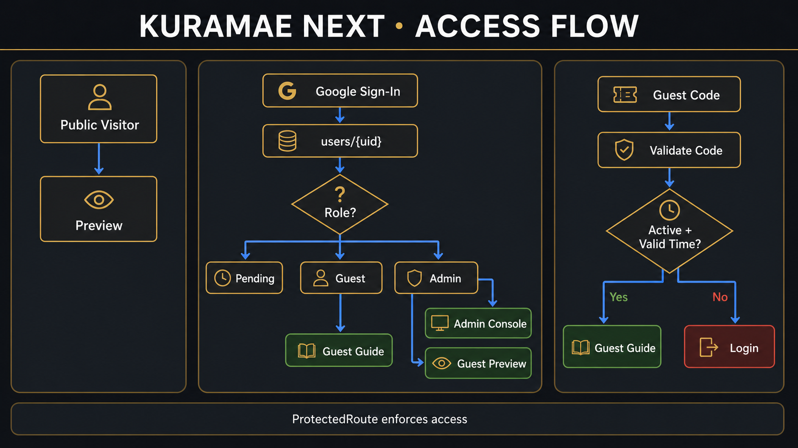
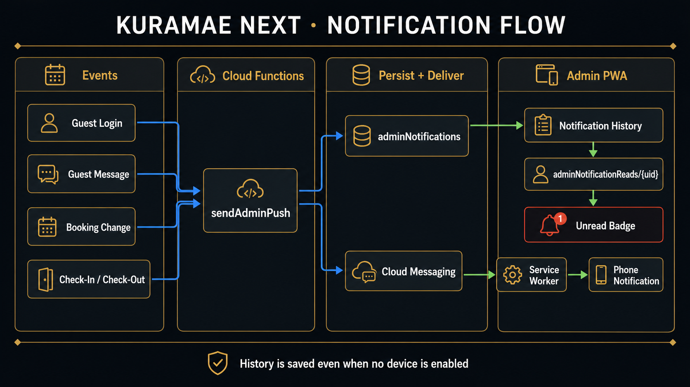

# KURACHEN Stay 系統架構

本文件提供人類可讀的系統導覽；開發規則與最新架構真相以根目錄及各子目錄 `AGENTS.md` 為準。

## 圖解

### 整體系統



### 登入與權限



### 通知與營運事件



## 執行層

| 層 | 技術 | 責任 |
|---|---|---|
| Web / PWA | React、TypeScript、Vite、React Router | Preview、Guest、Admin UI |
| Client services | Firebase Web SDK | Auth、Firestore listeners、Callable、FCM |
| Data | Firestore `default` | 營運資料、權限、通知歷史、留言、天氣快取 |
| Backend | Cloud Functions v2 / Node 24 | 事件、排程、Email、push、Maps、Weather |
| Delivery | Firebase Hosting / FCM / Gmail SMTP | 網站、手機通知、Email |

## 使用者與存取

```text
公開訪客
  └─ Preview

Google 使用者
  ├─ pending → 等待 Admin 核准
  ├─ active guest → Guest Guide
  └─ admin → Admin + Guest preview

訪客碼使用者
  └─ Callable 驗證有效碼 → Sanitized booking + private Guest Guide
```

Google 使用者的權限由 `users/{uid}` 與 `emailAccess/{email}` 決定。已啟用且綁定
預約的 Google guest 可由 Rules 讀取 `guestGuideContent/private`。訪客碼不再允許
client 直接讀取 `guestAccessCodes` 或 `bookings`；`getGuestPortalData` 驗證
`active`、`startsAt`、`expiresAt` 後，只回傳私密指南與經過清理的住宿摘要。

## 核心營運流程

### 預約

1. Admin 建立 booking。
2. batch 同步建立訪客碼與必要授權。
3. Function 寄送預約完成 Email。
4. Function 推播新預約並檢查日期／鑰匙衝突。
5. 入住與退房排程依台北時區執行。

### 訪客登入

1. Google guest 由 Auth／Rules 驗證；訪客碼由 `getGuestPortalData` 驗證。
2. Guest Layout 在授權後載入 `guestGuideContent/private` 並寫入 `guestPageViews`。
3. 訪客碼每日首次 `code_login` 由 Function 以
   `guestCodeDailyLogins/{code_date}` 去重。
4. Admin 收到 push，事件同時寫入 `adminNotifications`。
5. Guest Layout 集中載入當次預約姓名，供首次網站介紹、所有分頁頂部與首頁
   顯示 `Hi, {guestName}`；只有預約姓名尚未載入時才退回 Google 顯示名稱。

### Admin 房客視角預覽

1. Admin 點擊「查看房客頁面」後，系統即時讀取 booking，列出住宿中與尚未入住的
   住客，並依入住日期排序及標示目前住宿階段。
2. 選擇住客後，booking ID 僅儲存在 Admin 該分頁的 sessionStorage；Guest portal
   仍以 Admin 權限讀取 booking，不建立或冒用住客登入狀態。
3. Guest 首頁、姓名問候、入住倒數、住宿第幾天與退房狀態都使用選定 booking。
   頁面頂端會持續標示目前預覽的住客，並提供返回管理後台的入口。
4. 若沒有住宿中或未來預約，選擇器改為提供「無住客狀態」，呈現未綁定預約時的
   通用房客指南畫面。
5. 預覽列可將「今天」切換為入住前、入住日、住宿第 2 天、退房日或退房後。
   模擬日期只放在 Admin 分頁的 sessionStorage，不修改 booking，也不影響真正房客。

### Email 管理中心

1. `/admin/emails` 依 booking 計算預約完成、入住前一天 09:00 與退房日 12:00
   的預計寄送時間，並使用目前範本呈現個人化預覽。
2. 自動、排程、手動與測試寄送都由 Functions 寫入 `emailDeliveries`；client
   只能讀取，不能偽造成功狀態。
3. Admin 可將範本測試寄到自己的登入信箱，或確認後立即寄給房客。每次手動重寄
   會建立獨立紀錄；排程寄送使用固定 ID 避免 Function retry 重複寄信。
4. 今日待辦會整合最新失敗紀錄，以及已到排程時間但尚無成功紀錄的入住／退房信。

### Admin 今日待辦

1. 今日營運頁依目前 booking、Email delivery、付款、訪客碼與鑰匙狀態即時計算。
2. 付款完成、鑰匙交付與鑰匙歸還可在待辦中直接完成；缺 Email、缺訪客碼與寄信
   問題則 deep-link 到對應管理頁。
3. 待辦為資料狀態的投影，不另外建立可過期的 checklist collection。

### 訪客使用分析

1. Guest Layout 繼續記錄已驗證訪客的分頁瀏覽，並新增 Email 進站、PWA 教學／安裝、
   推薦地點點擊與退房清單進度等固定事件。
2. 新增事件只允許長度受限的 `targetId`、`targetLabel` 與 0–100 數值；不收集搜尋字詞、
   留言內容、門鎖、Wi-Fi 或其他住宿敏感內容。
3. `/admin/analytics` 讀取最近 2,000 筆 `guestPageViews`，提供 7／30／90 天摘要、
   使用旅程、每日趨勢、熱門頁面／地點與每位房客的完成訊號。
4. `admin_preview` 一律排除，訪客碼只作既有事件驗證與內部去重，不在儀表板顯示。
5. Functions 寄出的房客網站連結帶非個資的 Email 類型 attribution；訪客完成 Gmail
   或訪客碼驗證後才寫入 `email_entry`。

### Admin 付款資訊

1. Admin 在 `/admin/payment-information` 管理共用收款帳戶與房客訊息範本，
   資料儲存在 `settings/paymentInformation`，只允許 Admin 讀寫。
2. 頁面可選擇 booking，將房客姓名、預約金額與入住／退房日期套入訊息變數；
   未選預約時可產生不含特定住客資料的通用訊息。
3. 訊息在瀏覽器端即時預覽，一鍵複製後由管理員貼到既有通訊工具；系統不會
   自動對外傳送銀行帳戶或房客資料。

### 訪客 PWA 安裝

1. Guest Layout 載入後切換到 `guest-manifest.webmanifest`，並監聽瀏覽器的
   `beforeinstallprompt` 與 `appinstalled` 事件。
2. 每日歡迎視窗提供安裝介紹；「使用說明」頁保留固定入口。
3. iPhone／iPad 顯示 Safari「分享 → 加入主畫面」步驟；Android 優先呼叫
   瀏覽器原生安裝提示，無提示時顯示 Chrome 手動步驟。
4. 已在 standalone 模式開啟時顯示完成狀態。這個階段只改善安裝引導，
   不快取 Firestore 私密指南，也不承諾離線瀏覽。

### 訪客推薦牆

1. 訪客頁的「推薦牆」讀取 `guestCommunityMessages`，所有訪客看到相同內容。
2. 訪客送出推薦時呼叫 `createGuestCommunityMessage`；Function 驗證登入帳號或有效訪客碼。
3. Function 僅保存顯示名稱、內容、作者類型與時間，不保存訪客碼或 Email；訪客發文時發送 Admin push。
4. Admin 從同一面推薦牆公開回覆，也能刪除不適當內容；系統不再提供私人客服留言。

### 首頁天氣

1. Guest 首頁只在入住日與住宿期間呼叫 `getGuestWeather`；Function 驗證
   Google 帳號或有效訪客碼。
2. 一小時內優先回傳 `systemCache/kuramaeWeather`，避免每位房客重複呼叫外部服務。
3. 快取到期後由 Function 讀取日本氣象廳的東京觀測資料與預報，再更新共用快取；畫面標示資料來源與本站整理。
4. 氣象廳暫時無法回應時可顯示十二小時內的最近資料，並在畫面標示為較早資料；完全沒有可用資料時只隱藏天氣內容，不影響其他房客指南。

### 三階段房客首頁

1. `getStayStatus` 以 `Asia/Tokyo` 日曆日判斷首頁階段；入住日為第 1 天，
   退房日不再計入住天數。
2. 入住前顯示入住倒數，以及機場交通、抵達進房與入住須知入口。
3. 入住日到住宿期間顯示「入住第 N 天」、藏前天氣，並從 Firestore
   `recommendations`／預設地點按住宿日輪替餐廳、咖啡與景點。
4. 退房日隱藏一般準備與每日旅遊內容，改為顯示「今天退房」及儲存在瀏覽器
   localStorage 的可勾選退房清單。

### 推薦地點管理

1. Admin 在 `/admin/recommendations` 依分類搜尋、篩選與管理 Firestore
   `recommendations`；房客頁只讀取啟用且未封存的內容。
2. 一般編輯使用側邊抽屜與星星選擇器，Google Maps 查詢會自動填入名稱、地址、
   Place ID 與座標；技術欄位預設收在進階設定。
3. 顯示中的項目依分類獨立排序。拖曳、方向操作、停用、封存、恢復或刪除後，
   client 會以 Firestore batch 重新編成連續 `sortOrder`。
4. 批次操作支援顯示、停用、封存與恢復；封存以 `archivedAt` 軟刪除，永久刪除
   必須另外確認。`updatedAt` 與 `updatedBy` 顯示最近修改資訊。
5. 編輯器提供房客卡片預覽與顯示位置提示；管理清單即時提示缺少介紹、星等偏低、
   Maps 連結格式異常或 Place ID／連結疑似重複。
6. 手機版餐廳、購物與景點頁不使用固定高度的內層清單捲動；選取地點後會將整頁
   帶到地圖，地圖上的返回按鈕則回到剛才選取的地點卡片。

## 部署單位

| 改動 | Firebase surface |
|---|---|
| React、CSS、PWA、圖片 | Hosting |
| Firestore 欄位權限、query | Rules / indexes |
| trigger、排程、Email、push、Weather | Functions |

跨層改動依 Rules → Functions → Hosting 順序部署，避免新版 client 先遇到舊權限或舊後端。

## 安全邊界

- Preview 是唯一真正公開的內容面。
- Admin data 由 Firebase Auth + Firestore role rules 保護。
- Functions 系統 collection 只允許 Admin 讀或完全禁止 client。
- Secrets 使用 Firebase Secret Manager，不進 Git 或 client bundle。
- 地址、房號、Wi-Fi、入口與門鎖文字只存在 `guestGuideContent/private`，不編譯進公開 bundle。
- 訪客碼 client 只能透過 Callable 取得經過清理的資料，不能直接讀訪客碼或 booking 文件。
- 含入口、門鎖與平面圖的敏感圖片不進 Hosting bundle；未來若重新提供，必須使用受保護媒體端點。
